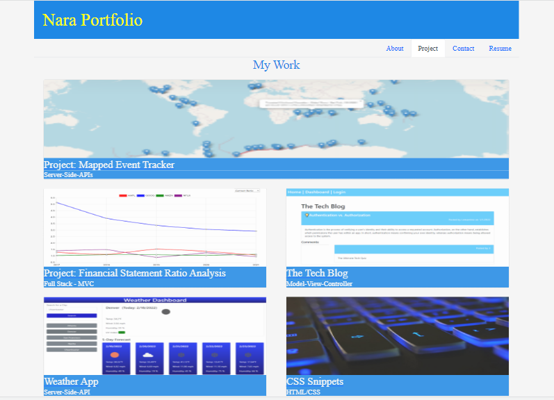

# 20 React: React Portfolio

Nara's Portfolio Website using the production build of React.js

## Table of Contents 

- [Description](#description)
- [User Story](#user-story)
- [Getting Started](#getting-started)
- [Solution](#solution)
- [Live](#live)

## Description

I upgraded my portfolio webpage using my React skills. I built this site completely from scratch and deployed it to Heroku. Tnpm 

## User Story

```md
AS AN employer looking for candidates with experience building single-page applications
I WANT to view a potential employee's deployed React portfolio of work samples
SO THAT I can assess whether they're a good candidate for an open position
```

## Solution

```md
GIVEN a single-page application portfolio for a web developer
WHEN I load the portfolio
THEN I am presented with a page containing a header, a section for content, and a footer
WHEN I view the header
THEN I am presented with the developer's name and navigation with titles corresponding to different sections of the portfolio
WHEN I view the navigation titles
THEN I am presented with the titles About Me, Portfolio, Contact, and Resume, and the title corresponding to the current section is highlighted
WHEN I click on a navigation title
THEN I am presented with the corresponding section below the navigation without the page reloading and that title is highlighted
WHEN I load the portfolio the first time
THEN the About Me title and section are selected by default
WHEN I am presented with the About Me section
THEN I see a recent photo or avatar of the developer and a short bio about them
WHEN I am presented with the Portfolio section
THEN I see titled images of six of the developer’s applications with links to both the deployed applications and the corresponding GitHub repositories
WHEN I am presented with the Contact section
THEN I see a contact form with fields for a name, an email address, and a message
WHEN I move my cursor out of one of the form fields without entering text
THEN I receive a notification that this field is required
WHEN I enter text into the email address field
THEN I receive a notification if I have entered an invalid email address
WHEN I am presented with the Resume section
THEN I see a link to a downloadable resume and a list of the developer’s proficiencies
WHEN I view the footer
THEN I am presented with text or icon links to the developer’s GitHub and LinkedIn profiles, and their profile on a third platform (Stack Overflow, Twitter)
```

## Getting Started

You’ll use `create-react-app` to build your portfolio, which will include the following:

* A single `Header` component that appears on multiple pages

* A single `Navigation` component within the header that will be used to conditionally render the different sections of your portfolio

* A single `Project` component that will be used multiple times in the Portfolio section

* A single `Footer` component that appears on multiple pages

**Note**: Because this application doesn’t include a back end or connect to an API, the contact form doesn't need to save this information right now. You'll add back-end functionality in the next few weeks. In the meantime, consider including your email address and phone number on the Contact page.

### Projects

For each project that is featured in your portfolio, include the following:

* An image of the deployed application (either a short animated GIF or screenshot)

* The title of the project

* A link to the deployed application

* A link to the corresponding GitHub repository

### Design

As with the previous portfolio Challenge, remember that "good" design is subjective; however, your site should look polished. Here are a few guidelines on what that means:

* Use mobile-first design.

* Choose a color palette that distinguishes your site from the default Bootstrap theme and unstyled HTML sites. Refer to resources like [Coolors](https://coolors.co/) or another color scheme generator to help you create something that will stand out.

* Ensure that the font size is large enough to read and that the colors don't cause eye strain.

* Consider using animations and React component libraries. Note that this will not affect your grade, but it might impact how potential employers gauge your knowledge.


### Technical Acceptance Criteria: 40%

* Satisfies all of the preceding acceptance criteria plus the following:

    * Application must use React to render content.

    * Application has a single `Header` component that appears on multiple pages, with a `Navigation` component within it that’s used to conditionally render About Me, Portfolio, Contact, and Resume sections.

    * Application has a single `Project` component that’s used multiple times in the Portfolio section.

    * Application has a single `Footer` component that appears on multiple pages.

    * Application must be deployed to GitHub Pages.

### Application Quality: 15%

* User experience is intuitive and easy to navigate.

* User interface style is clean and polished.

* Application uses a color scheme other than the default Bootstrap color palette.

## Wireframe

The portfolio webpage's functionality scheme and links:
```
Nara Portfolio
│
│ --About Me (my profile photo and short introduction)
│
│ --My Work (my latest 5 project links)
│
│ --Resume (downloadable PDF file)
│
└───Contact Me
    │
    └─── Phone
    │
    └─── Email
    │
    └─── GitHub (https://github.com/Nara1469)
    │
    └─── LinkedIn (https://linkedin.com/in/naradavaasuren)
```

## Live

This web application is deployed to Heroku.com. Here is a link to the deployed website. [Heroku](https://nara-portfolio-react.herokuapp.com/)

The following image shows the deployed webpage’s appearance: 

Some of my projects are displayed in Projects page: 

If you have any questions about the repo, open an issue or contact me directly at naraamtm@gmail.com. Here is a link to this application repo on [GitHub](https://github.com/Nara1469/nara-portfolio-react).